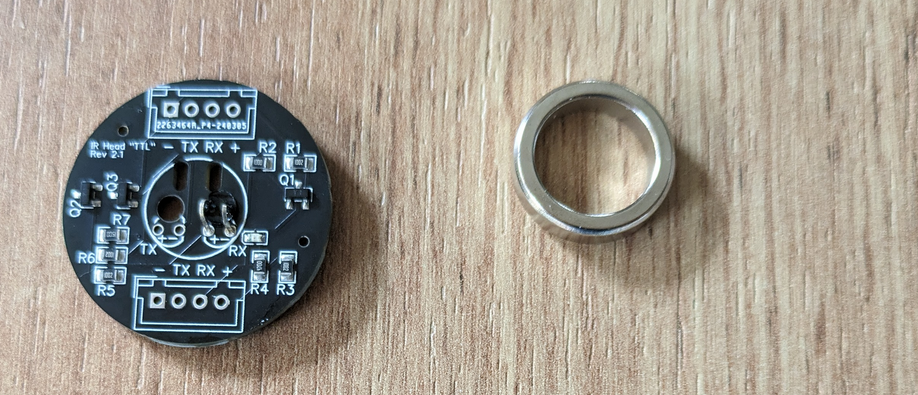
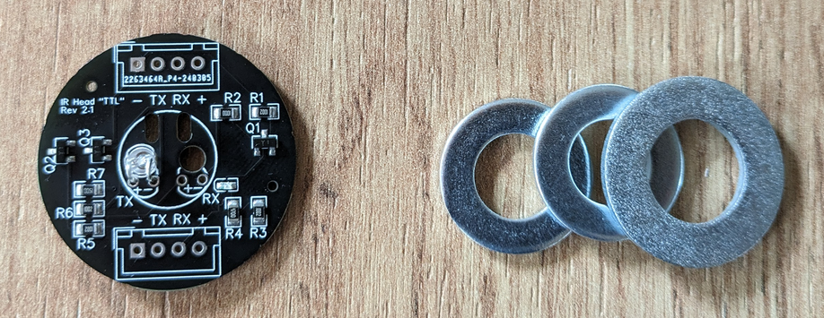
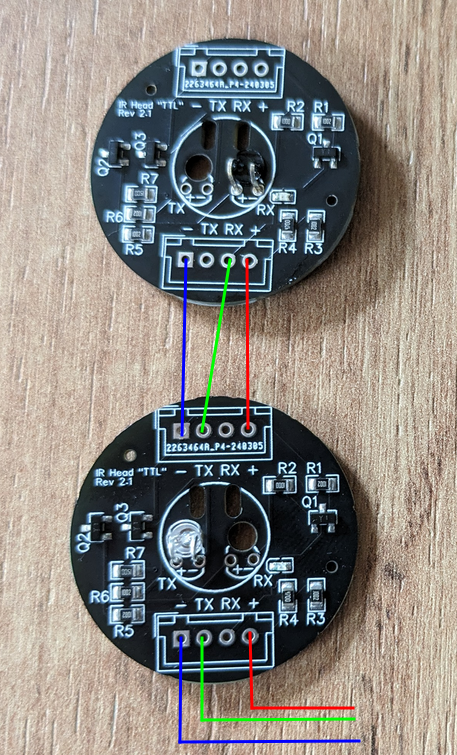

# Bausatz

Da ich öfter gefragt werde, ob ich auch Platinen verkaufe, biete ich diese je nach Verfügbarkeit an. Ich weise darauf hin, dass das ein reines Hobby-Projekt von mir ist und ich weder Haftung, Gewährleistung noch Funktionsgarantie übernehme.

## Lesekopf

Der Lesekopf ist mit dem passenden IR-Transistor an "RX" vorbestückt. Jeder Kopf wurde an meinem Testzähler getestet. Ich lege bei jedem Lesekopf einen passenden Neodym-Ringmagnet dazu.

## Schreibkopf

Der Schreibkopf ist mit einer IR-LED an "TX" vorbestückt. ZUm Test lege ich ein Signal n und schaue, dass die LED darauf reagiert. Ich lege bei jedem Schreibkopf 3 Unterlegscheiben bei. Die kleinere wird auf den Kopf aufgeklebt, die größere darüber, um dem Tibber-Pulse (oder einem anderen Lesekopf) eine größere Magnet-Fläche zu geben.

Einige Nutzer haben berichtet, dass der Tibber-Pulse mit größerem Abstand montiert werden muss. Deshalb lege ich noch eine dritte Unterlegscheibe bei.

## Verkabelung

Schreib- und Lesekopf werden mit 3.3V versorgt (Rot + Blau). Die Anschlüsse oben und unten an jedem Kopf sind identisch und durchgeschaltet, so dass es egal ist, ob oben oder unten angelötet wird.

Der RX-Anschluss vom Lesekopf wird mit dem TX-Anschluss des Schreibkopfes und mit dem seriellen Eingang des eigenen Empfängers (RX) verbunden (Grün).

## Benötigtes Zubehör

Nicht im Lieferumfang, aber benötigt werden:

* 3-poliges Kabel
* Stecker/Buchsen (optional) - es können gängige Stiftleisten und Buchsen mit 2.54mm verwendet werden
* Empfänger, zum Beispiel:
    * USB-TTL-Konverter oder
    * ESP32
    * GPIO eines Raspberry Pi
* Lötkolben und ein klein wenig Löterfahrung

Der Empfänger muss mit 3.3V Signalpegel arbeiten. Es empfielt sich, damit auch gleich die Schaltung mit 3.3V zu versorgen.

# Preise

Ich versende ein komplettes Set für **15 €**, bestehend aus:

* Lesekopf
* Schreibkopf
* Verpackung + Versand als Brief (unversichert)

Jeder weitere Lese- oder Schreibkopf kostet **5€** (incl. Magnet bzw. Unterlegscheiben). Wenn es nicht mehr in einen Großbrief passt, kommt noch die Differenz zum Maxibrief dazu.

Auf Wunsch und gegen Kostenübernahme versende ich natürlich auch als Paket.

# Bestellung

Bei Bedarf schreibt mich einfach kurz an (michael@wyraz.de) und schreibt, welche/wie viele Köpfe ihr benötigt.
