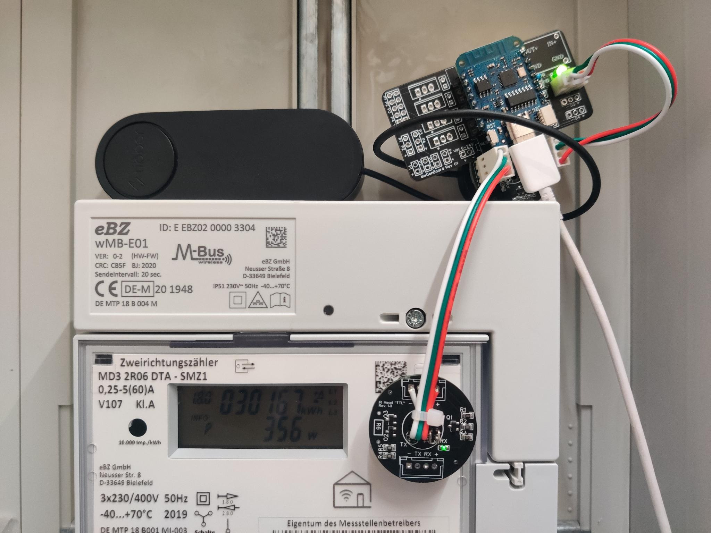
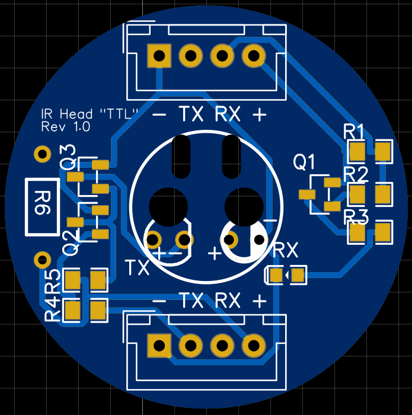

# IR Head "TTL"

Preiswerter IR Lese- und Schreibkopf zum Auslesen von Stromzählern und vervielfältigen des Datenstroms. Damit kann beispielsweise ein Tibber Pulse betrieben werden und parallel die Daten mit eigener Hardware ausgewertet werden.

Die Ausgänge (RX) und Eingänge (TX) verwenden die UART-Semantik: HIGH bedeutet "keine Daten" oder eine logische 0. LOW bedeutet eine logische 1. Dadurch können die Köpfen beispielsweise an einem USB-TTL-Adapter betrieben werden.

* Diskussion: https://github.com/evcc-io/evcc/discussions/7070
* Magnet: https://de.aliexpress.com/item/1005002662665532.html
* Beispiel-Konfiguration für ESPHome als Client: [esphome/irhead_v1.yaml](esphome/irhead_v1.yaml)

## Revision 1.0

 

### Aufbau Lesekopf

Der Lesekopf besteht aus einem IR-Transistor (Typ SFH309). Dieser ist gegen GND und mit einem Pullup (R1, 2,2 kΩ) gegen VCC geschaltet. Zwischen IR-Transistor und R1 kann das Signal des Stromzählers abgegriffen werden. Wird der IR-Transistor angeleuchtet, zieht er das Signal auf LOW, ansonsten ist es HIGH.

Ein nachgelagerter PNP-Transistor Q1 liefert auf LOW die Spanung für eine Kontroll-LED. Diese leuchtet immer dann, wenn der IR-Transistor angeleuchtet wird.

### Aufbau Schreibkopf

Der Schreibkopf besteht aus einer IR-LED, welche von einem PNP-Transistor (Q3) angesteuert wird. Ist dessen Eingang HIGH, leuchtet die IR-LED. Der Eingang von Q3 wird von R5 auf HIGH gezogen. Liegt ein HIGH-Signal an TX an, zieht Q2 den Eingang von Q3 auf LOW, die IR-LED geht aus. Damit wird das UART-Signal invertiert und die IR-LED leuchtet, wenn der IR-Transistor eines angeschlossenen Lesekopfes beleuchtet wird.

Der Schreibkopf kann auch unabhängig vom Lesekopf an einem 3,3V USB-TTL-Adapter oder einem anderen seriellen Port mit 3,3V betrieben werden.

### Aufbauanleitung

Der Kopf ist vorbestückt, mit Ausnahme der IR-LED und deren Vorwiderstand und dem IR-Transistor.

#### Lesekopf 

Für die Verwendung als Lesekopf muss lediglich der IR-Transistor bestückt werden. Kurzer PIN bzw. abgeflachte Seite muss an PLUS. Die Pins werden 2x um 90 Grad gebogen, so dass die Pins von der bestückten Seite her durchgesteckt werden und der Transistor von der bestückten Seite her durch das Loch schaut. Anlöten an "RX". Gelötet wird von der nicht bestückten Seite.

Mit doppelseitigen Klebeband oder besser einem guten dauerhaften Kleber wird der Magnet auf der nicht bestückten Seite innerhalb des Ringes befestigt.

#### Schreibkopf

Anschlüsse IR-LED (transparent) biegen und zuschneiden. Kurzer PIN bzw. abgeflachte Seite ist MINUS. Die Pins werden 2x um 90 Grad gebogen, so dass die Pins von der bestückten Seite her durchgesteckt werden und die LED von der bestückten Seite her durch das Loch schaut. Anlöten an "TX". Der passende Vorwiderstand für die LED muss an R6 gelötet werden. Gelötet wird von der nicht bestückten Seite.

Für die von mir verwendeten 3mm IR-LEDS ist ein Vorwiderstand von 100-150 Ohm geeignet. Soll ein Zähler optisch angesteuert werden, der sonst mit einer Taschenlampt bedient wird, kann hier auch eine weiße LED mit passendem Vorwiderstand verbaut werden.

Mit doppelseitigen Klebeband oder besser einem guten dauerhaften Kleber wird eine Unterlegscheibe M10 und darauf eine Unterlegscheibe M12 auf der nicht bestückten Seite innerhalb des Ringes befestigt. Ich suche hier noch eine optisch schönere Lösung. Die 12er Scheibe ist außen zu groß für den Ring und berührt die Kontakte der Kabelbefestigung. Die M10 ist etwas klein, um einen Lesekopf gut dran haften zu lassen.

#### Verkabelung

Lese- und Schreibkopf werden mit Minus (=GND) und Plus (=3.3V) aus dem ESP8266 oder ESP32 versorgt. TX vom Lesekopf wird an RX des Schreibkopfes und an einem GPIO des ESP angeschlossen. An jeder Platine sind oben und unten Anschlüsse, die 1:1 verbunden und gleichwertig sind. Die kleinen Schlitze sind für Zugentlastung (Kabelbinder oder Draht).

### Einschränkungen

Erfolgreich getestet wurde die folgende Konfiguration:

* 1 Lesekopf
* 1 Schreibkopf (z.B. für Tibber)
* 1 CMOS/GPIO Eingang (ESP32, ESP8266, evtl. auch Raspberry)

Was nicht geht:
* 2 oder mehr Schreibköpfe
* USB-TTL-Adapter statt dem ESP (der hat einen Eingang mit starken Pullup)
* mehr als 3.3V

